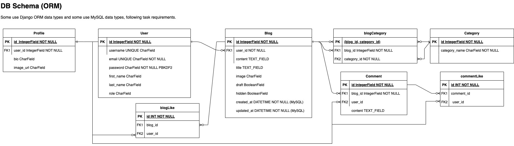

# Blog App

[](https://git.garena.com/rasyid.wijaya/entry-task-blog-app/backend/blog_app/.coverage)

This is a Django-based application for managing blogs, comments, user profiles, and categories.

## Requirements

Ensure you have Python 3.x


## Installation

1. Clone the repository:

   ```bash
   git clone <repository-url>
   cd blog_app
   ```

2. Install dependencies:

    ```
    pip install -r requirements.txt
    ```

3. Apply migrations:
    ```
    python manage.py migrate
    ```

4. Run server:
    ```
    python manage.py runserver
    ```

5. Testing:
    ```
    python manage.py test
    ```

6. Coverage report:
    Check the test coverage of the project:
    ```
    coverage report
    ```

### Additional Notes

- **Swagger UI:** Use the Swagger UI to test API endpoints directly from the browser, see request/response schemas, and understand API functionality. Navigate to [http://localhost:8000/swagger/](http://localhost:8000/swagger/)

### Database Schema


### Flow Chart


---
Rasyid
